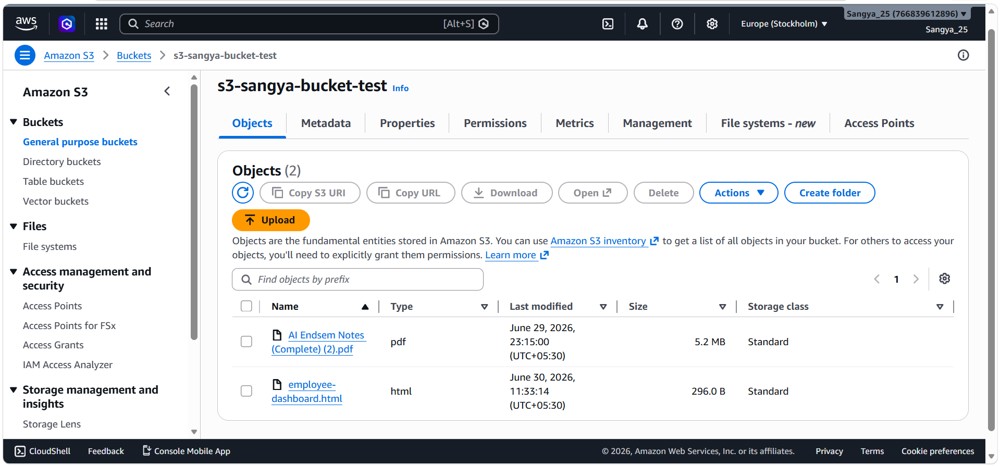

# Cloud Vault S3 Console

A Streamlit-based web interface to interact with AWS S3 — upload, list, download, and delete files directly from your browser.

## Demo

[Watch screen recording](https://cygrp-my.sharepoint.com/:v:/g/personal/sangya_ojha_cginfinity_com/IQBm1Hzwg5ZdT6vxeII_dCZRAdFWRsQFaAB7ZEIb6U4vXyc?e=LdHOR7) — full walkthrough: uploading files via Streamlit and verifying them in the AWS S3 bucket.

## S3 Bucket



> Bucket: `s3-sangya-bucket-test` (eu-north-1 / Stockholm)

## Stack

- **Streamlit** — UI
- **boto3** — AWS SDK for Python
- **python-dotenv** — credential management

## Setup

1. Clone the repo and install dependencies:
   ```bash
   pip install -r requirements.txt
   ```

2. Create a `.env` file:
   ```env
   AWS_ACCESS_KEY_ID=your_key
   AWS_SECRET_ACCESS_KEY=your_secret
   AWS_REGION=eu-north-1
   ```

3. Run the app:
   ```bash
   streamlit run app.py
   ```
